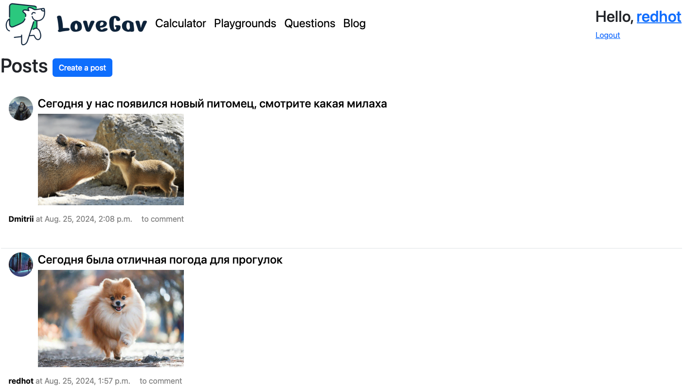

# Lovegav

Lovegav — это онлайн-платформа, созданная для владельцев домашних питомцев, чтобы делиться знаниями, опытом и налаживать общение. 
Проект состоит из веб-сайта и RESTful API, предоставляющего пользователям полный функционал для взаимодействия с платформой.

## Основные функции
- **Блог**: ведите собственный блог, публикуйте фотографии, просматривайте посты других пользователей и оставляйте комментарии.
- **Вопросы и ответы**: задавайте вопросы о питомцах и получайте ответы от сообщества.
- **Приватная страничка питомца**: храните персональную информацию о ваших питомцах, включая аватары, PDF-паспорта, данные о клеймах и прочее.
- **Дневник питомца**: запись и хранение информации о настроении питомца, течках, лечении, обработках от паразитов 
с возможностью экспорта дневника в pdf-формате для ветеринарного врача
- **Уведомления**: получайте напоминания о необходимости принятия лекарств.
- **Калькулятор нормы кормления**: рассчитывайте оптимальную норму кормления с учетом индивидуальных потребностей вашего питомца 
и получайте рекомендации по питанию.
- **Каталог площадок для выгула собак**: изучайте список площадок для прогулок в различных городах, с подробным описанием и фотографиями.

Проект также включает функции аутентификации и авторизации для обеспечения безопасности и конфиденциальности пользовательских данных.

## Структура проекта
- **blogapp**: модуль, отвечающий за функционал блога, включая просмотр публичных профилей владельцев, 
а также полный набор операций CRUD (создание, чтение, обновление, удаление) для постов и комментариев.
- **functionalapp**: модуль, включающий функционал расчета необходимых калорий и суточного количества корма для питомцев, 
отображения списка площадок для выгула собак, а также поддержку CRUD для вопросов и ответов.
- **profileapp**: модуль управления аутентификацией пользователей, профилями владельцев и их питомцев, а также ведения дневника питомцев.
- **PostgreSQL**: используется в качестве основной базы данных. 
При запуске контейнеров база данных автоматически наполняется тестовыми данными с помощью скрипта dump.sql.
- **uploads**: директория для хранения всех медиафайлов пользователей. 
Проект использует Docker и Docker Compose для развертывания и управления контейнерами.

### Веб-сайт
Стартовая страница веб-сайта доступна по адресу: http://127.0.0.1:8000/blog/posts/. 
Основная навигация расположена в верхней части страницы, а раздел аутентификации — в правом верхнем углу.


### REST API

Этот проект предоставляет доступ к различным ресурсам через RESTful API. 
Вы можете использовать API для взаимодействия с данными на платформе, включая управление профилями пользователей и питомцев, 
ведение блогов, управление вопросами и ответами, а также использование других функциональностей.

### Основные ресурсы API:

- **Профили и питомцы**: Управление профилями пользователей и их питомцами, включая создание, обновление, удаление и просмотр информации.
- **Дневник питомцев**: Ведение записей о настроении, лечении и других аспектах жизни питомцев.
- **Вопросы и ответы**: Публикация вопросов о питомцах и предоставление ответов от сообщества.
- **Блог**: Создание и управление постами и комментариями.

### Пример эндпоинта:

Для примера, эндпоинт для управления комментариями к блогам:

```plaintext
GET /blog/api/posts/<int:pk>/comments/<int:comment_pk>/
```

- **GET**: Получить детальную информацию о комментарии.
- **PUT**: Обновить информацию о комментарии.
- **DELETE**: Удалить комментарий.

#### Пример запроса

```
GET http://127.0.0.1:8000/blog/api/posts/2/comments/5/
```

#### Пример ответа

```plaintext
HTTP 200 OK
Allow: GET, PUT, DELETE, HEAD, OPTIONS
Content-Type: application/json
Vary: Accept

{
    "id": 5,
    "post": 2,
    "body": "Мой пес очень любит морковку",
    "data": "2024-08-25T13:57:57.974460Z",
    "author": 1
}
```

### Полная документация API

Для получения полного списка доступных эндпоинтов и их описаний, пожалуйста, ознакомьтесь с Swagger-документацией, которая доступна по адресу:

```plaintext
http://127.0.0.1:8080/
```
Swagger-документация предоставляет интерактивный интерфейс, позволяющий ознакомиться с возможностями API и протестировать различные запросы.

## Установка и запуск

Для развертывания всей необходимой инфраструктуры используйте Docker и Docker Compose.

### Предварительные требования

- Убедитесь, что у вас установлены Docker и Docker Compose
- Версия Python: 3.11

### Шаги установки

1. Клонируйте репозиторий проекта:

```
git clone https://github.com/RedHotChilliHead/LoveGav.git
cd LoveGav
```
2. Установите зависимости:
```
pip install -r requirements.txt
```
3. Соберите и запустите Docker-контейнеры:
```
docker compose up -d
docker compose run lovegav-lovegavapp-1 python manage.py migrate
```
Это создаст необходимые тома, соберет и запустит Docker-контейнеры в фоновом режиме и выполнит миграции.

Что бы остановить сервисы выполните команду 
```
docker compose down
```

## Тестирование

Тесты включают юнит-тесты для проверки работы API и веб-сайта в части модуля profileapp.
Что бы запустить тесты выполните команду 
```
docker compose run lovegavapp python manage.py test
```